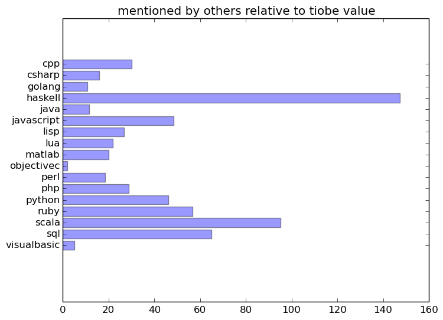
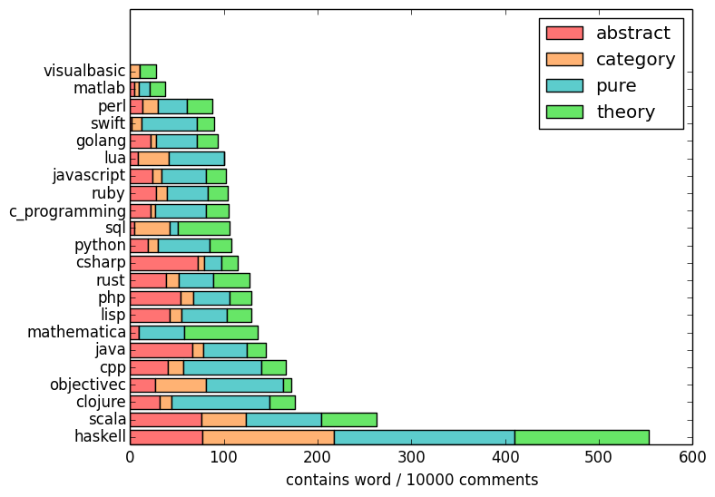

# Programming language subreddits and their choice of words

While reading about various programming languages, I developed a hunch about how often different languages are mentioned by other communities and about average the  conversational tones used by the people there.

To examine if it was just selective perception on my site, [an unconscious confirmation of stereotypes](http://en.wikipedia.org/wiki/Confirmation_bias), or a valid observation I collected and analysed some data, i.e. all comments (about 300k) written to submissions (about 40k) in respective programming language subreddits from 2013-08 to 2014-07 using [PRAW](https://praw.readthedocs.org) and [SQLite](https://docs.python.org/2/library/sqlite3.html).

In this article I will present some selected results. (If you want you can also download the [code I wrote/used](crawl.py) as well as the [raw data generated by it](analysis).)

## Mutual mentions

The following chord graph (click it for an [interactive version](http://daiw.de/github/programming-language-subreddits-and-their-choice-of-words/mentions_chord_graph/index.html)) shows how often a programming language is mentioned in communities (subreddits) not belonging to them:

[][interactive-mutual-mentions]

[interactive-mutual-mentions]: http://daiw.de/github/programming-language-subreddits-and-their-choice-of-words/mentions_chord_graph/index.html

([The size of a language is set by how often the others talk about it in sum. One connection represents the mutual mentions of two communities. The widths on each end is determined by the relative frequency of the mentionee being referenced by the respective other community.](http://www.reddit.com/r/programming/comments/2e2csa/programming_language_subreddits_and_their_choice/cjveh9u))

The "big" languages are the ones most talked about, *yawn*.

Sure, [measuring programming language popularity](http://en.wikipedia.org/wiki/Measuring_programming_language_popularity) accurately is nearly impossible, but if we still simply take some values from [TIOBE](http://www.tiobe.com/index.php/content/paperinfo/tpci/index.html) it gets interesting, because one can see how much is talked about a language relatively to how much it is supposedly used.

Here was the first time I said ["Ha! I knew it!"](http://en.wikipedia.org/wiki/Hindsight_bias).

(No Haskell bash intended. I love it and its little web cousin [Elm](http://elm-lang.org) and use them for [projects](https://github.com/Dobiasd/RedditTimeMachine) and also write [articles](https://github.com/Dobiasd/articles) about it.)

## Word usage

If we now divide the number of comments in a subreddit containing a chosen word by the overall subreddit comment count (and multiply by 10000 to have a nice integer value), we get more ... well, diagrams. But most results like the obsession with abstract concepts by the Haskell people and the consideration of hardware issues by people using C and C++ are not that surprising.

## Cursing

This part here is quite comforting, because a [conjecture many of us probably have](http://eev.ee/blog/2012/04/09/php-a-fractal-of-bad-design/) is confirmed.

## Happyness

To finish with something positive: The lispy guys seem to be the most cheerful people.

But what is up with the Visual Basic community? They are neither angry nor happy. They just ... are? :)

## Disclaimer

As you probably already noticed, this is not hard science. It was just a small fun project and contains several possiblities for errors. I tried to only choose big communities and frequent words so that there is at least a bit of statistical significance, but potential errors in my parser and interpretation (e.g. no taking negations into accout etc.) are also not to exclude. ;)

If somebody wants to repeat this exepriment to confirm/refute the results with more fancy tools like [nltk](http://www.nltk.org/) or something, I would be happy if you could [drop me an email](mailto:harry@daiw.de).