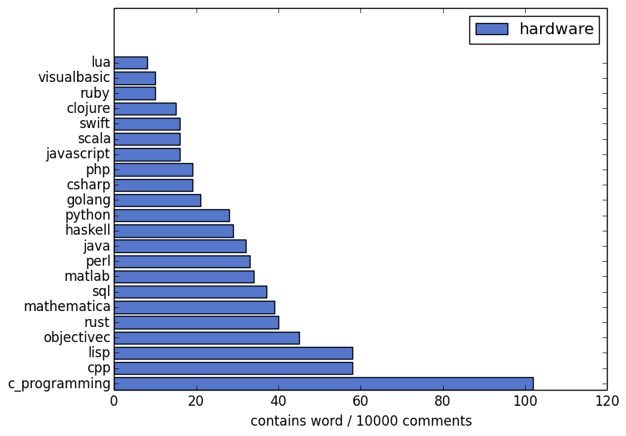
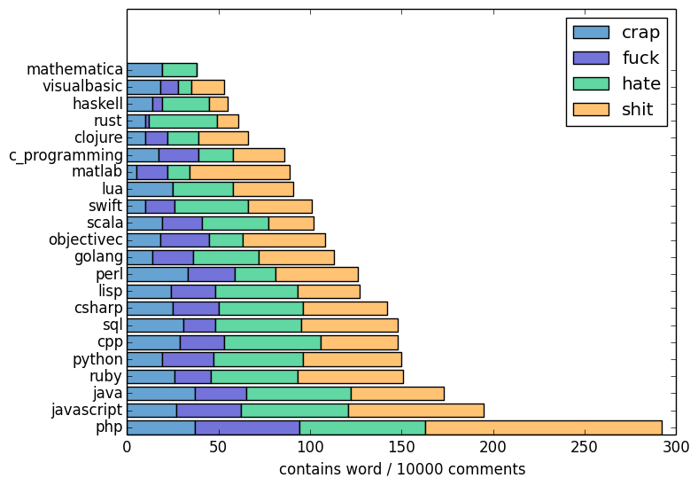
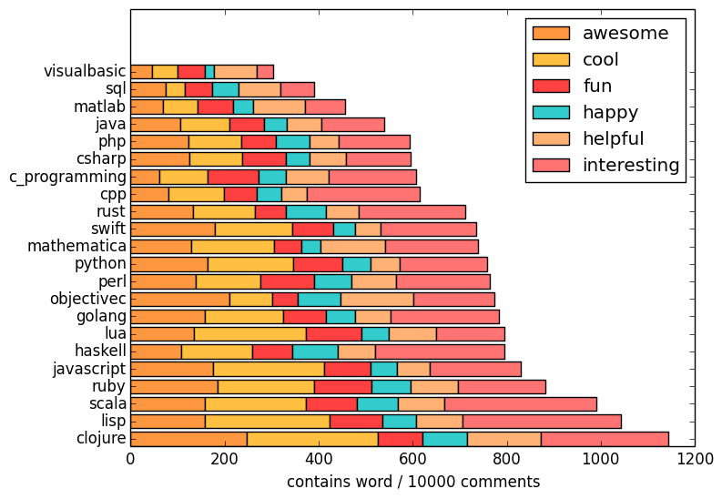

# Programming language subreddits and their choice of words

While reading about various programming languages, I developed a hunch about how often different languages are mentioned by other communities and about the  conversational tones used by the people there.

To examine if it was just selective perception on my site, [an unconscious confirmation of stereotypes](http://en.wikipedia.org/wiki/Confirmation_bias), or a valid observation I collected and analysed some data, i.e. all comments (about 300k) written to submissions (about 40k) in respective programming language subreddits from 2013-08 to 2014-07 using [PRAW](https://praw.readthedocs.org).

In this article I will present some selected results. (If you want you can also download the [code I wrote/used](crawl.py) as well as the [raw data generated by it](analysis).)

## Mutual mentions

The following ([click here for interactive version](http://rawgit.com/Dobiasd/programming-language-subreddits-and-their-choice-of-words/master/mentions_chord_graph/index.html)) chord graph shows how often a programming language is mentioned in communities (subreddits) not their own:

[][interactive-mutual-mentions]

[interactive-mutual-mentions]: http://rawgit.com/Dobiasd/programming-language-subreddits-and-their-choice-of-words/master/mentions_chord_graph/index.html

The size of a language is set by how othen the others talk about it in sum. One connection represents the mutual mentions of two communities. The widths on each end is determined by the relative frequency of the mentionee being referenced by the respective other community.

Sure, [measuring programming language popularity](http://en.wikipedia.org/wiki/Measuring_programming_language_popularity) accurately is nearly impossible, but if we still simply take some values from [tiobe](http://www.tiobe.com/index.php/content/paperinfo/tpci/index.html) one can see how much is talked about a language relatively to how much it is supposedly used.

Here was the first time I said ["Ha! I knew it!"](http://en.wikipedia.org/wiki/Hindsight_bias) (regarding Haskell).

## Word usage

Now I also divided the number of comments in a subreddit containing a word by the overall subreddit comment count. Some results like the obsession with abstract concepts by the Haskell people and the consideration of hardware issues by people using C and C++ are not that surprising, but what is up with the third one?

## Cursing

Here a [conjecture many of us probably have](http://eev.ee/blog/2012/04/09/php-a-fractal-of-bad-design/) will be confirmed.

## Happyness

I want to finish with something positive. The lispy guys seem to be the most positive people.

But what is up with the Visual Basic community? They are neither angry nor happy. They just are.

## Disclaimer

As you probably already noticed, this was not hard science. It was just a small fun project and contains several possiblities for errors. I tried to only choose communities and words so that there is at least a bit of statistical significance, but also errors in my parser and interpretation (e.g. no taking negations into accout etc.) are quite likely.

If somebody wants to repeat this exepriment to confirm or refute the results with more fancy tools like [nltk](http://www.nltk.org/) or something, I would be happy if you could [drop me an email](mailto:harry@daiw.de).